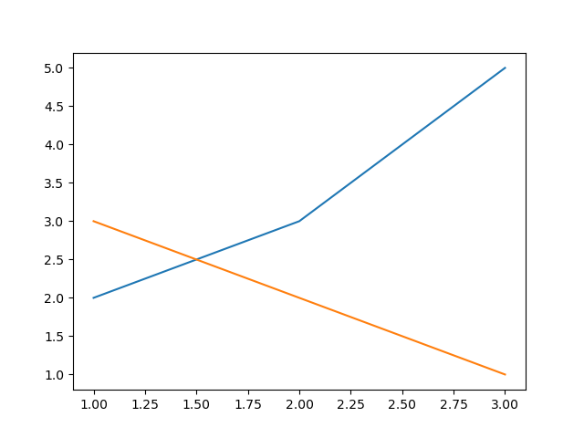

# Comparing two lines

You can also use the `plot` function to draw multiple lines into the same graph. And you can use the `legend` function to label the different plots. For example:

```python

import matplotlib.pyplot as plt

plt.plot([1, 2, 3], [2, 3, 5])
plt.plot([1, 2, 3], [3, 2, 1])
plt.legend(['line 1', 'line 2'])
plt.show()
```

yields the graph:



## TODO

Create three plots in the same graph, one for the function $f(x) = x$, one for the function $f(x) = x^2$ and one for the function $f(x) = exp(x)$ for $x \in [0, 0.1, ..., 2]$. Label your plots.
