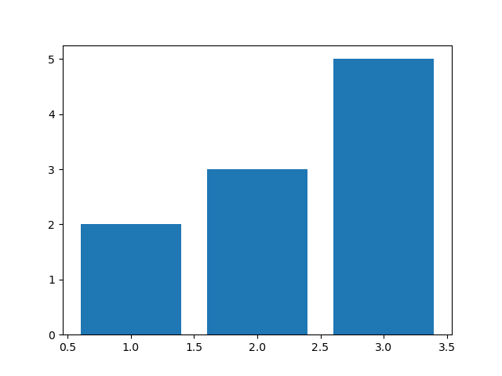
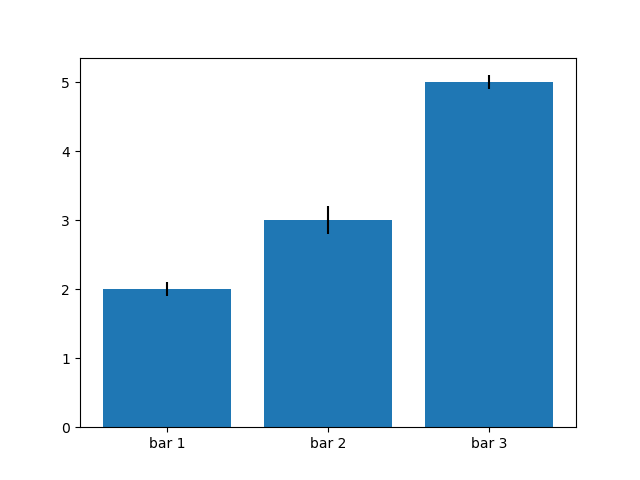

# Bar plots

With `matplotlib.pyplot.bar` function, you can create bar plots. It gets x and y coordinates, just as before, but the result looks different:

```python

import matplotlib.pyplot as plt

plt.bar([1, 2, 3], [2, 3, 5])
plt.show()
```

creates the following graph:



For such plots, we typically want to give each bar a name. We can change the labels on the x axis with the `xticks` function like this:

```python

import matplotlib.pyplot as plt

plt.bar([1, 2, 3], [2, 3, 5])
plt.xticks([1, 2, 3], ['bar 1', 'bar 2', 'bar 3'])
plt.show()
```

which creates the following graph:


Finally, we often want to draw lines to indicate how much the data spreads around the height of the bar. For that, we can use the `yerr` argument of the `bar` function. It takes a list of spread values, one for each bar.

```python

import matplotlib.pyplot as plt

plt.bar([1, 2, 3], [2, 3, 5], yerr = [0.1, 0.2, 0.1])
plt.xticks([1, 2, 3], ['bar 1', 'bar 2', 'bar 3'])
plt.show()
```

which creates the following graph:



## TODO

Create a plot with two bars. The first bar should show the mean value (with `yerr` showing standard deviation) of the numbers `[1, 3, 2, 3, 2, 3, 2]`, the second bar should show the mean value (with `yerr` showing standard deviation) for the numbers `[3, 2, 1, 2, 3, 2, 1]`. Label the bars as `"data 1"` and `"data 2"` on the x axis.

**Hint:** You are allowed to use the functions `np.mean` and `np.std` to compute mean and standard deviation of numbers in a list.
