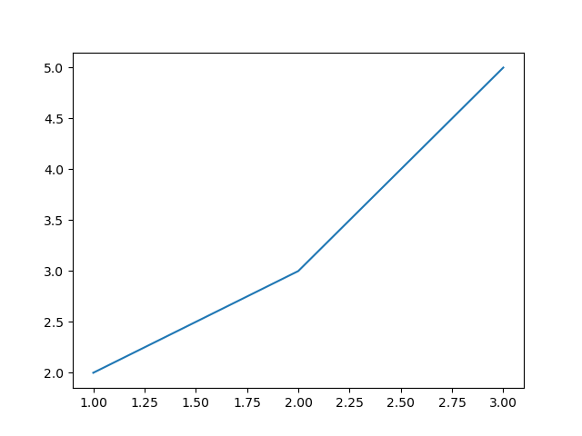

# Plotting the square function

With the `matplotlib.pyplot` package, you can create plots or graphs in python. Visualizing your data often helps to get first insight and build hypotheses what might be going on.

We start with the `matplotlib.pyplot.plot` function. This function takes two lists of numbers $x_1, ..., x_n$ and $y_1, ..., y_n$ as input and draws a line going through the coordinates $(x_1, y_1), ..., (x_n, y_n)$.

When you have called the `matplotlib.pyplot.plot` function, you need to also call `matplotlib.pyplot.show` to create the actual plot. So, for example, if we want to create a line going through the points `(1, 2)`, `(2, 3)` and `(3, 5)`, we can write:

```python

import matplotlib.pyplot as plt

plt.plot([1, 2, 3], [2, 3, 5])
plt.show()
```

which creates the following graph:




## TODO

Create a plot that shows the function $f(x) = x^2 + 3$ at the points $x \in [1, 2, 3, 4, 5, 6, 7, 8, 9, 10]$.
