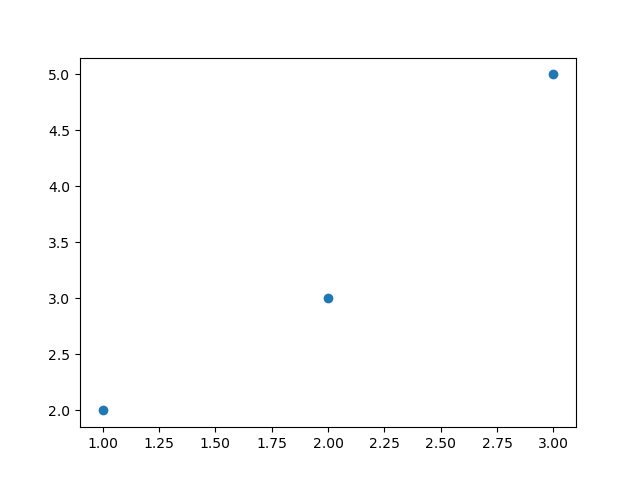

# Scatter plots with numpy

It turns out that `matplotlib.pyplot` and `numpy` work wonderfully together. You can put numpy arrays into plot functions just the same as lists.

We will test this with a scatter plot.

A scatter plot shows each data point as a single point without connecting them with a line. In `matplotlib`, this can be achieved in multiple ways (there is also a dedicated `scatter` function, for example), but we will simply use:

```python

import matplotlib.pyplot as plt

plt.plot([1, 2, 3], [2, 3, 5], 'o')
plt.show()
```

wich creates the following graph:



## TODO

Create a scatter plot with 100 standard normally distributed random numbers as x coordinates and 100 different standard normally distributed random numbers as y coordinates. You can use the `np.random.randn` function to generate the numbers.