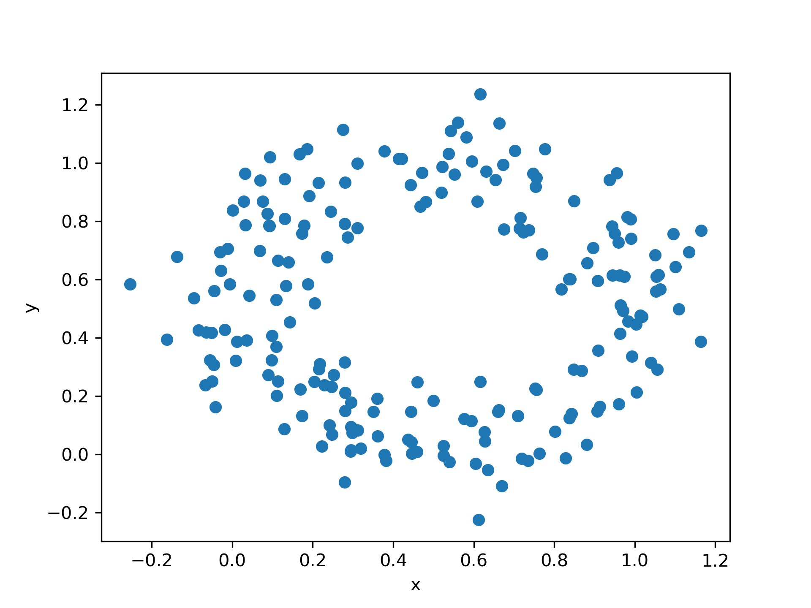

# Probability Theory: Correlation and Independence

Consider the random variables X and Y, each defined over [0, 1] with the following probability distribution

 

Which of the following statements is correct?